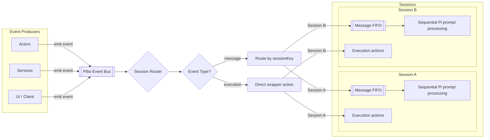

# Pibo Progress

Pibo is a minimal TypeScript wrapper around Pi Coding Agent. The current direction is clean and lean: Pi stays the inner engine, while pibo owns only the small profile, runtime, and routing layer needed around it.

## Current State

- V1 profile builder exists in `src/profiles.ts`.
- The default profile loads the local `pi-agent-harness` skill.
- Two minimal test tools are registered: `pibo_echo` and `pibo_workspace_info`.
- Example context files are appended from `examples/context/`.
- The Pi TUI can be started through `npm run tui`.
- The profile can be inspected through `npm run profile`.
- Session routing exists in `src/session-router.ts`.
- Gateway transport exists in `src/gateway/` and can be started with `npm run gateway`.
- A console gateway client exists through `npm run client -- <sessionKey>`.
- A gateway producer profile exists through `npm run tui:gateway`.
- Core event contracts live in `src/events.ts`.
- Gateway transport examples live in `examples/gateway/`.
- Gateway request/reply behavior is covered by `npm test`.

## Session Routing

The router is intentionally small. Producers emit events with a `sessionKey`. The router lazily creates one Pi runtime per session key, queues message events per session, and executes wrapper actions directly.

Message events are agent input. They enter the session FIFO and are sent to Pi with `session.prompt(...)`.

Execution events are wrapper actions. They do not become user messages and do not directly modify agent history. Current actions are `status`, `session_id`, `clear_queue`, `abort`, and `dispose`.

Slash commands are independent from this event naming. A slash command such as `/compact` can still be sent as a normal message event when it should wait behind queued messages.

The gateway daemon is the local transport boundary for now. It owns one session router, accepts newline-delimited JSON frames over TCP, and broadcasts normalized router events to connected clients. The current gateway tool, `pibo_gateway_send`, sends a message into a target session and waits for the correlated assistant reply.

## Next Direction

- Keep the router API stable and small.
- Add only execution actions that are clearly wrapper-level controls.
- Let Pi handle agent execution, tool calls, compaction, persistence, and TUI behavior.
- Keep transport-specific code under `src/gateway/`.
- Add disk resume by `sessionKey` later only when we introduce a real session index.
