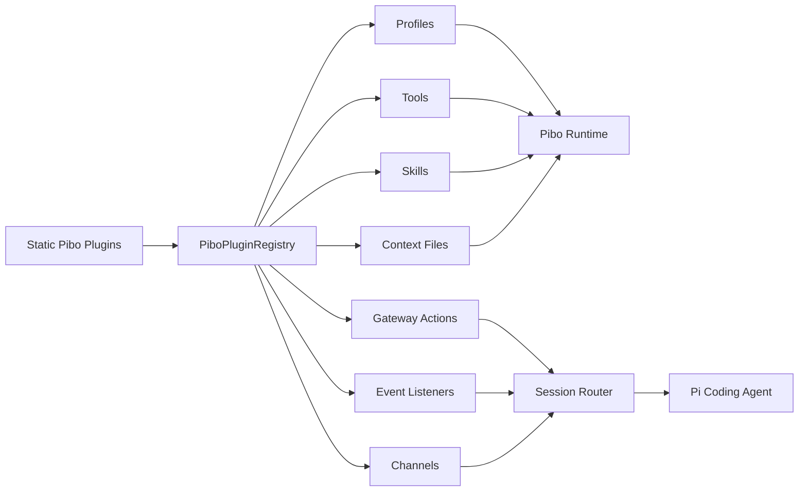
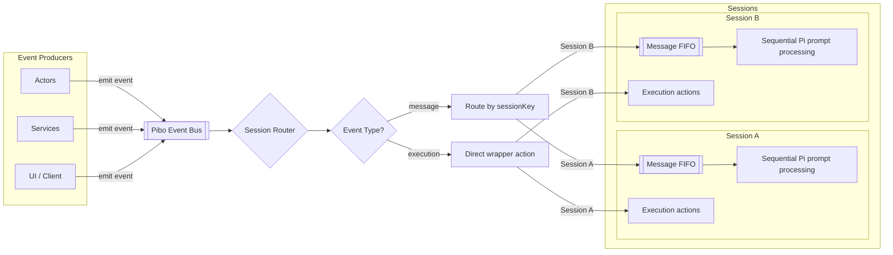

# Pibo Progress

Pibo is a minimal TypeScript wrapper around Pi Coding Agent. This file is a short project status note. The architectural snapshot lives in `docs/architecture.md`; MCP usage lives in `docs/mcp.md`; curated CLI tool usage lives in `docs/tools.md`.

## Current State

- V1 profile builder exists in `src/core/profiles.ts`.
- The default profile loads the local `pi-agent-harness` skill.
- Two minimal test tools are registered: `pibo_echo` and `pibo_workspace_info`.
- Example context files are appended from `examples/context/`.
- The Pi TUI can be started through `npm run tui`.
- The profile can be inspected through `npm run profile`.
- Session routing exists in `src/core/session-router.ts`.
- Gateway transport exists in `src/gateway/` and can be started with `npm run gateway`.
- A console gateway client exists through `npm run client -- <sessionKey>`.
- A gateway producer profile exists through `npm run tui:gateway`.
- Core event contracts live in `src/core/events.ts`.
- Gateway transport examples live in `examples/gateway/`.
- Gateway request/reply behavior is covered by `npm test`.
- A minimal static plugin layer exists in `src/plugins/`.
- Built-in plugins now register core tools, profiles, context files, skills, gateway actions, and event listeners through `PiboPluginRegistry`.
- `src/plugins/example.ts` demonstrates adding a plugin-provided skill, tool, and profile.
- The plugin registry supports subagent registration through `api.registerSubagent(...)`.
- Profiles can expose subagents through the same builder pattern as tools, skills, and context files.
- Plugins can register channels through `api.registerChannel(...)`.
- Plugins can register same-origin web apps through `api.registerWebApp(...)`.
- Gateway channel sessions are backed by SQLite session bindings in `.pibo/session-bindings.sqlite`.
- The built-in `remote-agent` channel exposes a local remote-control path on `127.0.0.1:4790`.
- The Pi-TUI remote controller is kept as a proof-of-concept example in `src/remote/examples/tui-controller.ts`.
- An authenticated web gateway path exists through `npm run gateway:web`, split into Better Auth, a same-origin web host, and the chat web app.
- A minimal Commander-based CLI manages local config values in `.pibo/config.json`.
- `pibo mcp` provides local MCP server discovery, schema inspection, search, tool calls, `mcp_servers.json` config management, and a small opt-in registry for common external MCP servers.
- The MCP registry command surface is in place, but there are currently no bundled presets.
- `pibo tools` manages curated external CLI tools separately from MCP and from profile skills. The first bundled tool is `browser-use`, pinned to `browser-use[cli]==0.12.6`, with on-demand install, doctor/path/env commands, and CLI guide output.

## Session Routing

The router is intentionally small. Producers emit events with a `sessionKey`. The router lazily creates one Pi runtime per session key, queues message events per session, and executes wrapper actions directly.

Message events are agent input. They enter the session FIFO and are sent to Pi with `session.prompt(...)`.

Execution events are wrapper actions. They do not become user messages and do not directly modify agent history. Current actions are `status`, `session_id`, `clear_queue`, `abort`, and `dispose`.

Slash commands are independent from this event naming. A slash command such as `/compact` can still be sent as a normal message event when it should wait behind queued messages.

The gateway daemon is the local transport boundary for now. It owns one session router, accepts newline-delimited JSON frames over TCP, and broadcasts normalized router events to connected clients. The current gateway tool, `pibo_gateway_send`, sends a message into a target session and waits for the correlated assistant reply.

## Plugin Layer

The plugin layer is intentionally static and internal. It gives pibo a clean extension boundary without adding a marketplace, dynamic package loading, manifests, or installer behavior.

Plugins can currently register:

- tools
- subagents
- skills
- context files
- agent profiles
- gateway execution actions
- output event listeners
- channels

The registry is a catalog only. It does not run Pi sessions and does not own transport. The session router and gateway consume registered profiles and gateway actions while Pi Coding Agent remains the inner execution engine.

The current example plugin registers the skill at `examples/skills/pibo-example-plugin/SKILL.md`, the tool `pibo_example_plugin_note`, the no-op channel `pibo-example-channel`, and the profile alias `example-plugin`. It is wired into the default static plugin list in `src/plugins/builtin.ts`.

## Subagents

Subagents are registered capabilities that profiles can opt into with `addSubagent(...)` or `addSubagents(...)`. Each subagent points at a target profile, so the called agent can have a different prompt context, skills, tools, and its own nested subagents.

At runtime, pibo turns enabled subagents into generated Pi tools named `pibo_subagent_<name>`. Calling one of these tools routes a message into a normal pibo session whose key follows:

```text
<parentSessionKey>::sub::<subagentName>::<threadKey>
```

Omitting `threadKey` creates a fresh child session. Reusing `threadKey` continues the same child session, which keeps subagent work inspectable and multi-turn. Sync subagents wait for the correlated reply; async subagents enqueue the work and return the child session key immediately.

## Channels And Session Bindings

Channels are plugin-owned adapters. They translate external transports such as a web app, Telegram, or another service into pibo input events and translate pibo output events back to the transport.

The channel context intentionally exposes only the product boundary:

- `emit(event)` routes a `PiboInputEvent`.
- `subscribe(listener)` observes normalized `PiboOutputEvent` values.
- `resolveSession(input)` creates or reuses a persistent binding.

Session bindings keep the conversation key separate from the agent profile:

```ts
type PiboSessionBinding = {
  sessionKey: string;
  channel: string;
  externalId: string;
  originalProfile: string;
  currentProfile?: string;
  workspace?: string;
};
```

The gateway uses SQLite for bindings by default. This keeps the original profile/workspace association durable without overloading the `sessionKey`.

## Remote Agent Channel

The first real channel plugin is `pibo.remote-agent`. It starts a local remote-control server and lets a local controller attach to a pibo session.

```text
Pi TUI Remote Controller
  -> remote_attach(sessionName, profile)
  -> capabilities(gateway actions)
  -> remote_input(message | execution)
  -> PiboChannelContext.emit(...)
  -> PiboSessionRouter
  -> Core Pi Coding Agent
  -> PiboOutputEvent
  -> remote_event
```

The Pi-TUI remote controller is intentionally kept as a proof of concept. `npm run remote -- <sessionName> [profile]` starts a local Pi TUI with a pibo extension. The extension intercepts normal input, forwards it through the remote channel, and renders remote output as styled TUI custom messages. Execution slash commands are discovered from the gateway action registry during attach, registered as Pi extension commands, and shown in slash autocomplete. Pi TUI built-in commands stay local; the line-based debug client is available through `npm run remote:line`.





## Next Direction

- Keep the router API stable and small.
- Add only execution actions that are clearly wrapper-level controls.
- Let Pi handle agent execution, tool calls, compaction, persistence, and TUI behavior.
- Keep transport-specific gateway code under `src/gateway/`.
- Keep reusable remote-channel code under `src/remote/`; keep controller experiments under `src/remote/examples/`.
- Keep plugins static until external loading has a concrete requirement.
- Build real web or messaging channels on top of `PiboChannel`, not directly against Pi.
- Keep auth as a gateway/channel boundary service; web apps such as chat should consume auth rather than live inside the auth plugin.
- Keep MCP presets optional and externally installed; do not turn registry entries into core package dependencies.
- Design explicit model-provider configuration for MCP-backed agent tools before sharing credentials with external servers.
- Add disk resume by `sessionKey` later only when we introduce a real session index.
