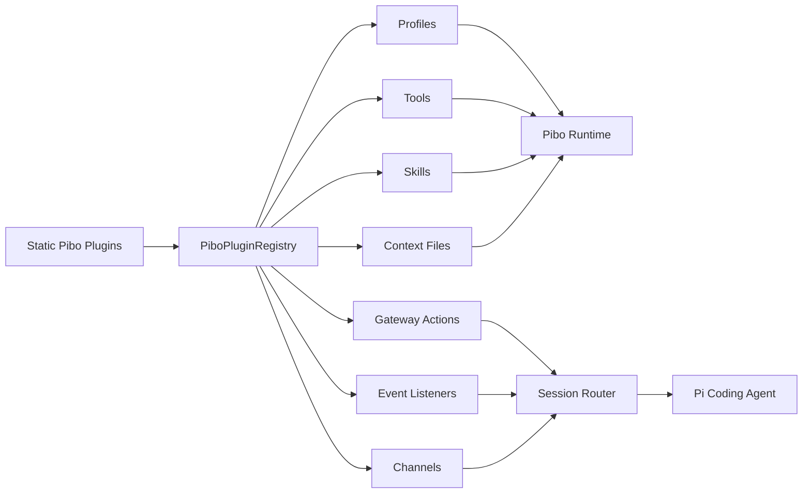
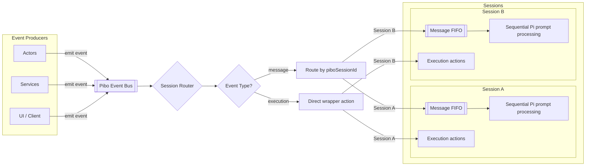

# Pibo Progress

Pibo is a minimal TypeScript wrapper around Pi Coding Agent. This file is a short project status note. The architectural snapshot lives in `docs/architecture.md`; local routed TUI usage lives in `docs/local-routed-tui.md`; MCP usage lives in `docs/mcp.md`; curated CLI tool usage lives in `docs/tools.md`.

## Current State

- V1 profile builder exists in `src/core/profiles.ts`.
- The default profile loads the local `pi-agent-harness` skill.
- Core tools are registered: `pibo_echo`, `pibo_workspace_info`, and `pibo_exec`.
- Example context files are appended from `examples/context/`.
- The Pi TUI can be started through `npm run tui`.
- The explicit local routed TUI can be started through `npm run tui:routed -- <profile>` and renders routed assistant deltas as a live streaming widget.
- Routed thinking events are normalized separately from assistant text and can be displayed by opt-in channel UI toggles such as local `/thinking-show`, `--show-thinking`, the chat web toggle, or gateway client `/thinking-show`. Routed `/thinking` keeps the Pi meaning and controls model effort.
- Routed tool-call and tool-execution events are normalized separately from assistant text. The local routed TUI reuses Pi render components for user, assistant, thinking, live tool, and completed tool blocks instead of maintaining a legacy renderer.
- The profile can be inspected through `npm run profile`.
- Session routing exists in `src/core/session-router.ts`.
- Gateway transport exists in `src/gateway/` and can be started with `npm run gateway`.
- A console gateway client exists through `npm run client -- <piboSessionId>`.
- A gateway producer profile exists through `npm run tui:gateway`.
- A `run-yield-qa` profile exists for manual QA of yielded runs through the routed runtime.
- Core event contracts live in `src/core/events.ts`.
- Execution events now include typed Pi session controls for current session metadata, session listing, fork candidates, fork, clone, tree navigation, and session switching.
- Gateway transport examples live in `examples/gateway/`.
- Gateway request/reply behavior is covered by `npm test`.
- A minimal static plugin layer exists in `src/plugins/`.
- Built-in plugins now register core tools, profiles, context files, skills, gateway actions, and event listeners through `PiboPluginRegistry`.
- `src/plugins/example.ts` demonstrates adding a plugin-provided skill, tool, and profile.
- The plugin registry supports subagent registration through `api.registerSubagent(...)`.
- Profiles can expose subagents through the same builder pattern as tools, skills, and context files.
- Profiles with yieldable tools expose yielded-run tools for tracked or detached tool runs.
- Yielded runs are tracked in-memory by the session router with compact parent notifications, bounded waits, read/cancel/ack controls, and simple TTL cleanup.
- Plugins can register channels through `api.registerChannel(...)`.
- Plugins can register same-origin web apps through `api.registerWebApp(...)`.
- Gateway channel sessions are backed by the SQLite Pibo Session store in `.pibo/pibo-sessions.sqlite`.
- The local routed TUI adapter lives in `src/local/` and uses an in-process router instead of a gateway daemon.
- An authenticated web gateway path exists through `npm run gateway:web`, split into Better Auth, a same-origin web host, and the chat web app.
- The Chat Web App can create, rename, archive, restore, and permanently delete personal sessions after `Delete this session` confirmation; session deletion also removes child sessions and their Chat Web read-model/event-log rows. It reconstructs trace nodes from Pi JSONL plus raw Pibo events; groups persisted tool calls under the final assistant response; filters empty reasoning artifacts from trace output; and streams compact AG-UI-inspired SSE frames into running trace nodes.
- The Chat Web App now has Pibo Rooms, a personal default room on first bootstrap, room-scoped session lists, durable `chat_events`, cursor-based unread badges for rooms and sessions, frame-specific SSE catch-up cursors, and idempotent sends through `clientTxnId`.
- The Chat Web trace UI defaults to expansion depth `1`, provides compact icon controls for default, collapse all, expand all, and expand to nesting level, and keeps top-level messages readable without opening nested tool details.
- The Chat Web composer starts as a one-line input, grows through five visible lines, scrolls internally afterward, preserves cursor position during normal edits, keeps the slash command selection scrolled into view, and uses a bottom-aligned send icon button.
- The Chat Web raw event inspector is hidden behind an explicit debug toggle and compacts adjacent assistant/thinking deltas with the same `eventId` for readability.
- The Chat Web Agents area is now an Agent Designer. It persists custom agents in `.pibo/chat-agents.sqlite`, registers active custom agents as dynamic profiles, and lets users configure native plugin tools, skills, context files, subagents, built-in Pi tool visibility, and the `pibo-run-control` package. The Agents view uses one sidebar for editable custom agents, archived custom agents, and read-only plugin profiles; plugin profiles can be inspected and copied into custom agent drafts. Custom agent names are lowercase kebab-case profile names used consistently across UI, sessions, and the backend registry. Custom agents can be archived, restored, and permanently deleted after exact-name confirmation; permanent deletion also deletes Chat sessions using that profile.
- Agent Designer configuration intentionally excludes curated external CLI tools from `pibo tools`; those tools remain globally available operator tooling instead of per-agent native tool selections.
- A minimal Commander-based CLI manages local config values in `.pibo/config.json` and uses progressive, agent-oriented discovery output.
- `pibo mcp` provides local MCP server discovery, schema inspection, search, tool calls, `mcp_servers.json` config management, and a small opt-in registry for common external MCP servers.
- The MCP registry command surface is in place, but there are currently no bundled presets.
- `pibo tools` manages curated external CLI tools separately from MCP and from profile skills. The first bundled tool is `browser-use`, pinned to `browser-use[cli]==0.12.6`, with on-demand install, doctor/path/env commands, and CLI guide output.

## Session Routing

The router is intentionally small. Producers emit events with a `piboSessionId`. The router resolves the matching Pibo Session record, lazily creates one Pi runtime per Pibo Session ID, queues message events per session, and executes wrapper actions directly.

Message events are agent input. They enter the session FIFO and are sent to Pi with `session.prompt(...)`.

Execution events are wrapper actions. They do not become user messages. Current non-session actions are `status`, `session_id`, `clear_queue`, `abort`, and `dispose`.

Pi session actions are also exposed through the same execution path:

- `session.current`
- `session.list`
- `session.fork_candidates`
- `session.fork`
- `session.clone`
- `session.tree`
- `session.tree_navigate`
- `session.switch`

Fork and clone call Pi Coding Agent's underlying operations but surface as new visible Pibo Sessions with `kind: "branch"` and `originId` pointing at the source session. The source session remains linked to its previous `piSessionId`. Tree navigation stays in the selected Pi session and moves the active leaf.

Slash commands are independent from this event naming. A slash command such as `/compact` can still be sent as a normal message event when it should wait behind queued messages.

The gateway daemon is the local transport boundary for now. It owns one session router, accepts newline-delimited JSON frames over TCP, and broadcasts normalized router events to connected clients. Execution frames may include typed JSON params for parameterized actions such as `session.fork`, `session.tree_navigate`, and `session.switch`. The current gateway tool, `pibo_gateway_send`, sends a message into a target session and waits for the correlated assistant reply.

## Plugin Layer

The plugin layer is intentionally static and internal. It gives pibo a clean extension boundary without adding a marketplace, dynamic package loading, manifests, or installer behavior.

Plugins can currently register:

- tools
- subagents
- skills
- context files
- agent profiles
- gateway execution actions
- output event listeners
- channels

The registry is a catalog only. It does not run Pi sessions and does not own transport. The session router and gateway consume registered profiles and gateway actions while Pi Coding Agent remains the inner execution engine.

The current example plugin registers the skill at `examples/skills/pibo-example-plugin/SKILL.md`, the tool `pibo_example_plugin_note`, the no-op channel `pibo-example-channel`, and the profile alias `example-plugin`. It is wired into the default static plugin list in `src/plugins/builtin.ts`.

## Subagents

Subagents are registered capabilities that profiles can opt into with `addSubagent(...)` or `addSubagents(...)`. Each subagent points at a target profile, so the called agent can have a different prompt context, skills, tools, and its own nested subagents.

At runtime, pibo turns enabled subagents into generated Pi tools named `pibo_subagent_<name>`. Calling one of these tools routes a message into a normal child Pibo Session:

```text
channel: pibo.subagents
kind: subagent
parentId: <parent Pibo Session ID>
profile: <target profile>
metadata: { subagentName, subagentToolName, threadKey }
```

Omitting `threadKey` creates a fresh child session. Reusing the same parent, target profile, subagent metadata, and `threadKey` continues the same child session, which keeps subagent work inspectable and multi-turn. Subagent tools are synchronous normal tools; long-running subagent work is yielded by wrapping the subagent tool with `pibo_run_start`.

Profiles that expose yieldable tools can expose run-control tools through the `pibo-run-control` package. `pibo_run_start` wraps a yieldable tool call as a yielded run and returns a `runId`; `pibo_run_list`, `pibo_run_status`, `pibo_run_wait`, `pibo_run_read`, `pibo_run_cancel`, and `pibo_run_ack` manage the run afterward. Tracked runs are the default and remind the parent agent with compact `<pibo_run_notification>` service messages until they are read, cancelled, or acknowledged. Detached runs are explicit fire-and-forget work and do not create automatic reminders.

## Channels And Pibo Sessions

Channels are plugin-owned adapters. They translate external transports such as a web app, Telegram, or another service into pibo input events and translate pibo output events back to the transport.

The channel context intentionally exposes only the product boundary:

- `emit(event)` routes a `PiboInputEvent`.
- `subscribe(listener)` observes normalized `PiboOutputEvent` values.
- `getSession(id)`, `createSession(input)`, `updateSession(id, input)`, `deleteSession(id)`, and `findSessions(input)` work with Pibo Session records.

Pibo Sessions keep product routing data separate from the technical Pi session id:

```ts
type PiboSession = {
  id: string;
  piSessionId: string;
  channel: string;
  kind: string;
  profile: string;
  ownerScope?: string;
  parentId?: string;
  originId?: string;
  workspace?: string;
  title?: string;
  metadata?: Record<string, unknown>;
};
```

The gateway uses SQLite for Pibo Sessions by default. Channels and tools route by stable `PiboSession.id`; Pi persistence and provider cache affinity use `PiboSession.piSessionId`. Subagent nesting uses `parentId`. Fork/clone derivation uses `originId`.

## Channel Examples

```text
Chat Web App
  -> same-origin API request
  -> auth/session policy
  -> create/select Pibo Session(ownerScope=user:<userId>, channel=pibo.chat-web)
  -> PiboSessionRouter
  -> Core Pi Coding Agent
  -> PiboOutputEvent
  -> HTTP response / streamed UI update
```

The chat web path is the primary concrete channel example. It shows how a channel resolves identity to an owner scope, creates or selects Pibo Sessions, emits routed input events, observes normalized output events, and keeps auth outside the agent runtime.

Live chat updates use same-origin SSE at `/api/chat/events`. The server keeps subscribing to normalized router output events, but `src/apps/chat/stream.ts` converts them into compact frames before writing `event: pibo`. Assistant and reasoning content are sent as delta frames, while lifecycle, tool, subagent, execution, and fallback raw frames keep the trace UI structurally current without polling the full trace after every token.





## Next Direction

- Keep the router API stable and small.
- Add only execution actions that are clearly wrapper-level controls.
- Let Pi handle agent execution, tool calls, compaction, persistence, and TUI behavior.
- Keep transport-specific gateway code under `src/gateway/`.
- Keep plugins static until external loading has a concrete requirement.
- Build real web or messaging channels on top of `PiboChannel`, not directly against Pi.
- Keep auth as a gateway/channel boundary service; web apps such as chat should consume auth rather than live inside the auth plugin.
- Keep MCP presets optional and externally installed; do not turn registry entries into core package dependencies.
- Design explicit model-provider configuration for MCP-backed agent tools before sharing credentials with external servers.
- Keep disk resume explicit through the Pibo Session store; do not infer product state from Pi session filenames.
